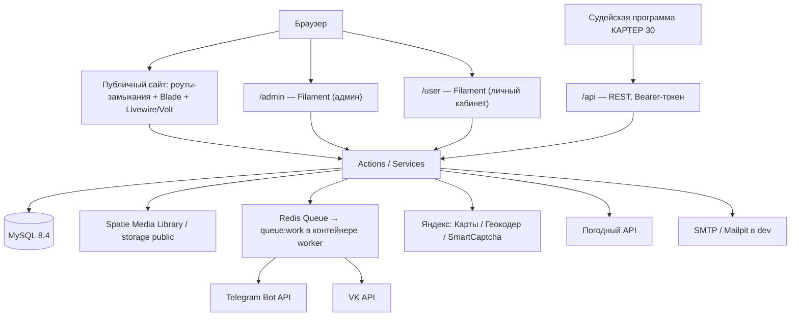
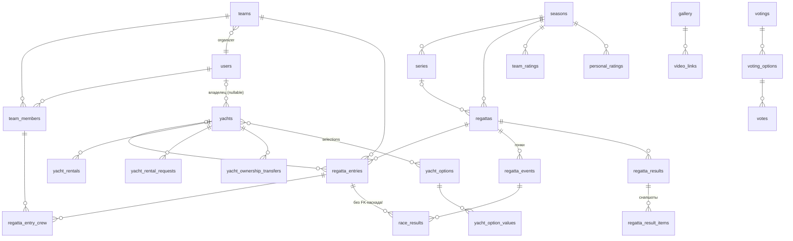

# DESIGN.md — Архитектура проекта «Yacht Association»

_Документ отражает фактическую архитектуру на 2026-07-18 (изначальная версия была проектом «до реализации» и сильно устарела). Актуальную структуру каталогов см. в [`PROJECT_STRUCTURE.md`](PROJECT_STRUCTURE.md), термины предметной области — в [`doc.md`](doc.md), правила для ИИ-агентов — в [`AGENTS.md`](AGENTS.md)._

## 1. Технологический стек (TALL)

| Компонент | Технология | Версия |
|-----------|-----------|--------|
| **T** — Стили | Tailwind CSS (+ Vite 8) | 4.x |
| **A** — Интерактивность | Alpine.js (+ flatpickr) | 3.x |
| **L** — Бэкенд | Laravel (PHP ^8.3) | 13.x |
| **L** — Динамические компоненты | Livewire + Volt | 3.x / 1.x |
| Админ-панель и ЛК | Filament PHP (две панели) | 4.x |
| Аутентификация | Laravel Breeze (Livewire-стек) | 2.x |
| Медиа-файлы | Spatie Media Library | 11.x |
| База данных | MySQL | 8.4 |
| Кэш / Очереди | Redis | — |
| PDF | barryvdh/laravel-dompdf | 3.x |
| Excel | phpoffice/phpspreadsheet | 5.x |
| UI-киты | TallStackUI, filament-map-picker, filament-yandex-map | — |
| Тесты | PHPUnit | 12.x |
| Окружение | Laravel Sail (Docker: app, worker, mysql, redis, meilisearch, mailpit, selenium) | — |

## 2. Архитектура высокого уровня

Контроллеров практически нет: публичные страницы — замыкания в `routes/web.php`, отдающие Blade-шаблоны; интерактив — Livewire-компоненты; мутации — Action-классы; интеграции и расчёты — Service-классы.

## 3. Схема базы данных

### Домены и таблицы (ключевые поля)

**Пользователи и команды**
- `users` — external_id, ФИО (first/last/patronymic), birth_date, sport_category, about, email/phone (+verified_at), photo_url, `system_role`, creation_source, is_banned; soft deletes.
- `teams` — external_id, name, organizer_id→users, default_yacht_id→yachts, approval_status, is_archived; soft deletes.
- `team_members` — team_id, user_id, `role` (organizer/team_admin/member), status (в т.ч. left), is_permanent, joined_at.
- `team_member_invitations` — приглашение участника (в т.ч. из другой команды): team_id, user_id, from_team_id, requested_by, status, rejection_reason.

**Яхты**
- `yachts` — name, `vfps_number` (уник.), user_id→users (владелец, **nullable — см. OwnedScope**), gims_number, class/project/year, home_region, mooring_place, for_rent, suitable_for, approval_status, owner_* (контакты), past_regattas; soft deletes.
- `yacht_document_types` — типы документов яхты/пользователя (`owner`), настраиваются в админке.
- `yacht_ownership_transfers` — заявки на смену владельца: yacht_id, requester_id, previous_owner_id, status, reviewed_by.
- `yacht_rentals` — занятые диапазоны дат аренды: yacht_id, date_start/date_end, price_event/price_pro.
- `yacht_rental_requests` — публичные заявки на аренду: yacht_id, name, phone, desired_date(_end), status (pending/approved/rejected), user_id.
- `yacht_options` / `yacht_option_values` / `yacht_option_selections` — справочник опций аренды и выбор значений для яхты.

**Соревнования**
- `seasons` — год, даты; `series` — группа регат внутри сезона.
- `regattas` — season_id, series_id, `type` (club/regular/travel, см. ниже), name, `level_coefficient`, date/time start/end, location + coordinates, water_area, описания, regulations, races_count, entry_fee_required/amount, `entry_required_documents` (json), `regatta_status` (upcoming/closest/active/finished/cancelled/postponed), postponed_to_date/note/regatta_id; для регулярных — seat_price/boat_price/race_hours_per_day, для выездных — crew_size_limit; soft deletes.
- `regatta_events` — **гонки** регаты (event_datetime); `regatta_schedule_events` — программа/расписание регаты.
- `regatta_entries` — заявки: regatta_id, team_id (**nullable** — у индивидуальных и сборных заявок команды нет), yacht_id, `participation_kind` (crew/individual), user_id (автор заявки — адресат уведомлений), `status` (pending/approved/rejected/withdrawn), source, documents_complete, fee_paid, entry_password, open_for_join + join_conditions/join_contact_email (добор людей в экипаж).
- `regatta_entry_crew` — экипаж заявки: regatta_entry_id, team_member_id (**nullable**), user_id/full_name/email/phone (участник сборного экипажа без команды), role (в т.ч. captain).
- `crew_join_requests` — отклики «Хочу в этот экипаж»: regatta_entry_id, user_id (nullable — гость), контакты, message, status (pending/accepted/declined), resolved_at/resolved_by.
- `race_results` — результат гонки: event_id→regatta_events, regatta_entry_id, position/points (string — допускают DNF/DNS и пр.), penalty_code.
- `regatta_results` — итоговый протокол регаты (result_type, source, is_published, pdf_path) и `regatta_result_items` — строки протокола со **снапшотами** (team_name, yacht_name, sail_number, captain_name, crew_snapshot, race_breakdown) + `regatta_entry_id` (nullable — прямая связь с заявкой, по ней начисляется личный рейтинг экипажам без команды) + override-флаги для ручной правки total_points/final_position, not_participate.
- `team_ratings` / `personal_ratings` — рейтинг сезона по командам/участникам (total_points, rank_position).
- `sequences` — счётчики (генерация номеров).

**Финансы**
- `payment_registries` — платежи с morph-привязкой `payable` (например, к заявке); name, amount, status, document.
- `financial_reports`, `expenses` — публикуемые документы отчётности.

**Контент и обратная связь**
- `news` — author_id, type, title, content, external_url, cover_image_url (+object_position), published_to_tg/vk, published_at; soft deletes.
- `gallery` (+ `video_links`) — альбомы (season_id, regatta_id, images json, cover) и видео-ссылки.
- `help` / `help_category` — раздел «Помощь» (специалисты, контакты); soft deletes.
- `faqs`, `user_questions` — FAQ и вопросы пользователей (ответ можно импортировать в FAQ).
- `documents` — morph `documentable`: файлы, привязанные к любым сущностям.
- `votings` / `voting_options` / `votes` — голосования (анонимность, множественный выбор, период).
- `feedback_requests` — обращения с формы обратной связи.
- `settings` — key/value (+group) настройки страниц сайта, редактируются в админке через `SettingsService`.
- `media` — таблица Spatie Media Library (morph, кастомная модель `App\Models\Media`).
- `api_clients` — Bearer-токены (хэши) внешнего API судейской программы; выпуск/отзыв — в админке (`SiteSettings`).

### Связи (компактно)

> ⚠️ Каскад `race_results` → `regatta_entries` **не обеспечивается БД**: очистку осиротевших результатов и пересчёт выполняет `RegattaEntryResultObserver`. Удалять заявки только через Eloquent.

## 4. Роли и права доступа

Системные роли (`App\Enums\SystemRole`, поле `users.system_role`): `user`, `admin`, `judge`, `secretary`, `accountant`, `developer_admin`. Доступ к разделам админки ограничивается через `RestrictsAccessByRole` + страница `AccessControlSettings`; хелперы — `App\Support\AccessControl`.

**Админ-разработчик** (`developer_admin`) — ведёт только собственные регаты:

- Разделы: жёсткий белый список `AccessControl::developerAdminAllowed()`, а не матрица прав. Матрица считает не настроенный пункт разрешённым, поэтому новая роль получила бы там полный доступ.
- Строки: владелец регаты — `regattas.user_id`, проставляется хуком `creating` в `Regatta::booted()` (через `??=`, чтобы `replicate()` не терял автора). Поле намеренно **не** в `$fillable`.
- Ограничение выборки — скоуп `Regatta::scopeVisibleForUser()` + трейт `App\Filament\Concerns\ScopesToOwnedRegattas` в ресурсах. Глобального скоупа нет: он затронул бы публичный сайт, API и импорт. Скоуп сужает только эту роль, для остальных и для гостей — no-op.
- Регаты без владельца (`user_id IS NULL` — созданные до введения роли, импортом или консолью) этой роли не видны.
- Серии для роли скрыты (глобальны, управлять ими она не может), личный кабинет `/user` — как у прочих сотрудников.

Роли в команде (`App\Enums\TeamMemberRole`, поле `team_members.role`): `organizer`, `team_admin`, `member`. Проверки — `TeamRoleGuard`, `TeamPolicy` (подача заявок на регату, управление составом).

## 5. Структура директорий

Актуальная структура и разбор по доменам — в [`PROJECT_STRUCTURE.md`](PROJECT_STRUCTURE.md). Ключевое:

- `app/Actions/{Regatta,RegattaEntry,RegattaResult,Team,Yacht,YachtRental,Voting,Feedback,Document}/` — бизнес-логика (Single Action Classes);
- `app/Services/` — расчёты (`RaceScorer`, `RatingCalculator`), `SettingsService`, `Rgd/RgdParser`, интеграции (Telegram, VK, Яндекс, погода);
- `app/Filament/` — админ-панель; `app/Filament/User/` — личный кабинет;
- `app/Livewire/` — публичные компоненты; `app/Observers/` — регистрируются в `AppServiceProvider`;
- `routes/web.php` (замыкания), `routes/auth.php` (Breeze), `routes/api.php` (внешний API судейской программы), `routes/console.php` (планировщик).

## 6. Маршрутизация (фактическая)

### Публичные маршруты (`routes/web.php`)

| Метод | URI | Описание |
|-------|-----|----------|
| GET | `/` | Главная: новости, галерея, FAQ, партнёры, таймер и календарь регат |
| GET | `/association/{charter,management,trustees,regulations,decisions,votings}` | Раздел «Ассоциация» (контент из `settings` + документы) |
| POST | `/association/votings/{voting}/vote` | Голосование (`CastVoteAction`) |
| GET | `/competitions` | Список регат |
| GET | `/regattas/{regatta}` | Карточка регаты |
| GET | `/regattas/entries` | Заявки на регаты |
| GET | `/regattas/calendar/pdf` | PDF-календарь сезона |
| GET | `/regatta/{regatta}/download-{documents,teams,teams-pdf,results-pdf}` | Выгрузки по регате (архивы, PDF) |
| GET | `/series/results`, `/series/{series}` | Результаты серий |
| GET | `/teams` (+ `/team/{team}/download-history`) | Команды, PDF-история команды |
| GET | `/yachts` | Каталог яхт (вкл. аренду) |
| POST | `/yachts/{yacht}/rental-request` | Заявка на аренду (`SubmitYachtRentalRequestAction`) |
| GET | `/ratings` | Рейтинги (командный/личный) |
| GET | `/news`, `/news/{news}` | Новости |
| GET | `/gallery` (+ `/gallery/{gallery}/download`) | Галерея, скачивание альбома |
| GET | `/help` | Помощь |
| POST | `/feedback`, `/questions` | Обратная связь (Yandex SmartCaptcha), вопрос (auth + throttle) |

### Панели Filament

| URI | Панель | Содержимое |
|-----|--------|-----------|
| `/admin` | `AdminPanelProvider` | ~25 ресурсов (регаты, заявки pending/archived, результаты, команды, рейтинги, яхты + опции/типы документов/передачи владения, аренда, пользователи, новости, галерея, помощь, FAQ, голосования, финансы, серии, вопросы), страницы настроек разделов сайта (`*PageSettings`, `SiteSettings`, `AccessControlSettings`), виджеты |
| `/user` | `UserPanelProvider` | ЛК: мои команды, яхты, заявки на регаты, результаты, аренда, передачи владения, вопросы, профиль |

Аутентификация — Breeze (`routes/auth.php`) + Livewire `Auth/LoginModal`; вход в панели — `FilamentAuthenticate`.

### Внешний API (`routes/api.php`)

REST API для судейской программы «КАРТЕР 30». Middleware `api.token` (`VerifyApiToken`) проверяет Bearer-токен по хэшу в `api_clients` (выпуск токенов — админка, `SiteSettings`). Регата резолвится по `external_id` (`Regatta::getRouteKeyName()`).

| Метод | URI | Назначение |
|-------|-----|-----------|
| GET | `/api/regattas` | Список регат (поиск по external_id) |
| GET | `/api/regattas/{regatta}/participants` | Экспорт участников в формате КАРТЕР 30 (`RgdParticipantsExporter`) |
| POST | `/api/regattas/{regatta}/results` | Импорт результатов регаты (`ImportResultsRequest`, далее — конвейер импорта результатов) |

Проверка доступности — команда `api:check` (`ApiCheck`).

## 7. Ключевые бизнес-процессы

### 7.1. Типы соревнований
`App\Enums\RegattaType` (`regattas.type`) — один тип на регату, определяет способ заявки и цвет регаты в календарях:
- **Клубная** (`club`, дефолт) — заявляются экипажи со своей яхтой. Экипаж может открыть добор людей со стороны (`open_for_join`), тогда в списке заявок появляется кнопка «Хочу в этот экипаж».
- **Регулярная** (`regular`) — ассоциация выставляет лодки и продаёт места: `seat_price`, `boat_price`, `race_days_count` + `race_hours_per_day`; экипаж до 6 человек либо индивидуальная заявка.
- **Выездная** (`travel`) — вне московского региона; размер экипажа задаётся `crew_size_limit` (зависит от флота регаты).

Рейтинг от типа не зависит: любая регата идёт в зачёт по своему `level_coefficient`, а «вне зачёта» — это коэффициент 0. Цвет типа (`RegattaType::backgroundClass()`) используется в графическом календаре (фон плашки), текстовом списке (бейдж) и фильтрах; статус (предстоящая/состоявшаяся) вынесен в фильтры, прошедшие регаты в списке гасятся цветом шрифта.

### 7.2. Заявка на регату
**Клубные:** `JoinRegattaModal` (Livewire) → `SubmitRegattaEntryAction`: создаёт `RegattaEntry` + `RegattaEntryCrew`, письма (`RegattaEntrySubmitted`, `SendRegattaEntryPassword` — пароль для редактирования заявки без входа). Обязательные документы заявки — `UpdateRegattaEntryRequiredDocumentsAction`, оплата — `PaymentRegistry` (morph payable) + `RegattaEntryFeeObserver`.

**Регулярные и выездные:** `SeatEntryModal` → `SubmitSeatEntryAction`: заявка экипажем или индивидуально, без команды и яхты (их назначает ассоциация), сумма считается по `seat_price` × число человек либо `boat_price`. Такие заявки создаются со статусом `pending` — они обязательно проходят через администратора (ресурс «Одобрение заявок»); об исходе автор узнаёт из `RegattaEntryModerationObserver` → `RegattaEntryModeratedNotification`.

**Добор в экипаж:** `CrewJoinModal` → `SubmitCrewJoinRequestAction` создаёт `CrewJoinRequest` и рассылает уведомления (письмо на почту экипажа и в info@, уведомления в ЛК автору заявки и администраторам). Решение — `ResolveCrewJoinRequestAction` (ресурс «Заявки в экипажи»): принятый кандидат добавляется строкой в `regatta_entry_crew`, не меняя состав команды.

**Мастер «Хочу участвовать»** (кнопка под hero на главной): `ParticipationWizard` + `ParticipationOptions`. Четыре шага — вариант участия (экипажем/индивидуально) → регата → лодка или число мест → заявка. Тип регаты человек не выбирает: список общий по всем типам, тип виден цветной меткой в строке и определяет дальнейшие шаги. Сам мастер только подбирает варианты, а на последнем шаге отдаёт работу существующим формам и действиям:

| Ветка | Что предлагается | Куда уходит заявка |
|-------|------------------|--------------------|
| Клубная, экипажем | своя лодка либо свободная арендная на даты регаты (`Yacht::availableForRent`) | `JoinRegattaModal` / `SubmitYachtRentalRequestAction` |
| Клубная, индивидуально | экипажи с `open_for_join` | `CrewJoinModal` |
| Регулярная | лодка ассоциации или число мест | `SubmitSeatEntryAction` |
| Выездная | лодка целиком или места в экипаже на регате партнёров | `SubmitSeatEntryAction` |
| Выездная (зарубежная) | регаты раздела «Услуги» в том же списке | карточка регаты со своей формой (`ServiceRequest`) |

Зарубежные регаты попадают в выездные и фильтруются по объявленным `participation_options`: «яхта целиком» — для экипажа, «место»/«каюта» — для индивидуального участия. Число купленных мест хранится в `regatta_entries.seats`: индивидуальная заявка берёт места и на спутников, чьи имена ещё не известны, и счёт выставляется по ним.

### 7.3. Результаты и рейтинги
Импорт протокола: `ImportRegattaResultItemsAction` (Excel), `ImportRgdResultItemsAction` + `Services/Rgd/RgdParser` (формат RGD, также команда `regattas:import-rgd`) или по API от судейской программы (`POST /api/regattas/{regatta}/results` + `ApplyRegattaResultsAction`). Очки считает `RaceScorer` (позиции/штрафы — строки: DNF, DNS и т.п.), рейтинги сезона — `RatingCalculator` (+ команда `ratings:recalculate` и действие пересчёта в ресурсах рейтингов админки) с учётом `level_coefficient`; места — dense ranking по `rank_position`. Строки протокола хранят снапшоты состава и разбивку по гонкам; ручные правки — override-флаги. Публикация протокола — `is_published`, PDF — `GenerateRegattaResultPdfAction`. Пересчёты триггерятся обсерверами (`RegattaEntryResultObserver`, `RegattaResultItemObserver`).

### 7.4. Публикация новостей в соцсети
Новость с `published_at` в будущем публикуется отложенно: планировщик ежеминутно запускает `news:publish-to-telegram` / `news:publish-to-vk` → jobs `PublishNewsToTelegram` / `PublishNewsToVk` → `TelegramService` / `VkService` (поддерживают прокси); флаги `published_to_tg/vk`. `NewsObserver` — сопутствующая логика при сохранении.

### 7.5. Аренда яхт
Яхта с `for_rent=true` показывается в каталоге аренды с опциями (`yacht_options`) и занятыми датами (`yacht_rentals`, календарь в админке — `Forms/Components/RentalCalendar`). Публичная заявка → `SubmitYachtRentalRequestAction` → `YachtRentalRequest` (+ письмо `YachtRentalRequested`); одобрение в админке бронирует даты.

### 7.6. Передача владения яхтой
Пользователь в ЛК подаёт `YachtOwnershipTransfer` (яхты без владельца ищутся по `vfps_number` через `withoutGlobalScopes()`); админ одобряет — яхта перепривязывается к новому владельцу.

### 7.7. Статусы регат
Команда `regattas:update-statuses` (ежеминутно) переводит регаты по датам: upcoming → closest → active → finished; поддерживаются cancelled/postponed (с переносом на дату или другую регату).

### 7.8. Онлайн-оплата (эквайринг)
**Верификация e-mail — обязательное условие оплаты** (см. 7.8).

Провайдер-агностичный движок в `app/Services/Payments`: контракт `PaymentGateway` (создание платежа, статус, верификация вебхука, cancel/refund; DTO с заделом под чеки 54-ФЗ), резолв активного провайдера — `PaymentManager` по настройкам группы `payments` (страница «Онлайн-оплата» в админке). Попытки оплаты — `PaymentTransaction` (N транзакций на запись `PaymentRegistry`); `StartOnlinePaymentAction` создаёт транзакцию и редиректит на `confirmation_url`, результат идемпотентно применяет `ApplyPaymentResultAction` (атомарный захват статуса; реестр → `Paid`/`Online` обычным `update()`, чтобы сработал `PaymentRegistryObserver` → `fee_paid`; письмо `PaymentSucceeded`). Вебхук — `POST /api/payments/webhook/{provider}` (без CSRF/MaintenanceMode), возврат плательщика — `payments.return`, сверка зависших — `payments:reconcile` (каждые 15 мин). Реальный банк не подключён: реализован `TestPaymentProvider` (внутренний симулятор по подписанной ссылке, работает в local/staging или по явному флагу). Первая точка использования — стартовый взнос заявки (кнопки в ЛК и в `JoinRegattaModal`).

### 7.9. Верификация e-mail
`User` реализует `MustVerifyEmail`; письмо — брендированное `VerifyEmailMail` через переопределённый `sendEmailVerificationNotification()` (подписанная ссылка формата Laravel, срок — `config('auth.verification.expire')`, сутки). Единая точка отправки — `SendEmailVerificationLinkAction` (троттлинг 3 письма / 10 мин на пару «e-mail + IP», отказ для технических адресов `@noemail.local`); её вызывают регистрация (`LoginModal::register`), гостевая быстрая заявка, смена e-mail в профиле ЛК (`EditProfile` сбрасывает `email_verified_at`) и все кнопки «отправить ещё раз». Подтверждение — стандартный `VerifyEmailController`; `markEmailAsVerified()` переопределён на `saveQuietly()`, иначе хук `saving` (проверка дублей ФИО) блокирует подтверждение.

**Гейт**: онлайн-оплата доступна только с подтверждённым e-mail — проверка в `StartOnlinePaymentAction` (до переиспользования транзакции). UI: в ЛК и на экране поданной заявки вместо «Оплатить» показывается «Подтвердите e-mail», в панели ЛК — баннер (`EmailVerificationBanner`, renderHook `TOPBAR_AFTER`). В админке — колонка/фильтр статуса и действия «Письмо для подтверждения» / «Подтвердить вручную» (для офлайн-оплат, только админ).

### 7.10. Реестр платежей: подтверждение и журнал изменений
Записи `payment_registries` ведут учёт приходов. Помимо статуса оплаты есть **отметка бухгалтера** о фактическом поступлении средств (`confirmed_at`/`confirmed_by`, ставится только через `ConfirmPaymentRegistryAction` — поля не в `$fillable`), колонка «последний изменивший» (`updated_by`; null → «Система» для вебхука и консоли) и `SoftDeletes`. Форма расчёта (наличные/безнал) не хранится отдельно, а выводится из `payment_method` через `PaymentSettlement` — есть колонка, фильтр и итоговая сумма по выборке.

**Журнал изменений** — таблица `payment_registry_logs` (событие `PaymentRegistryLogEvent`, JSON `changed_fields` с raw-значениями и подписями, снапшоты названия/суммы платежа и ФИО актора, IP). Пишет `PaymentRegistryLogger` (синглтон; `withoutAutoLog()` глушит авто-запись, когда Action пишет семантическое событие) через `PaymentRegistryLogObserver`. Тихие изменения (`updateQuietly`/`saveQuietly`, Query Builder) событий модели не порождают — в таких местах вызывается `PaymentRegistryLogger::updatedQuietly($registry, $before)` со снимком старых значений (см. `RegattaEntryFeeObserver`). Просмотр — read-only раздел «Журнал изменений» (фильтры по событию, пользователю, платежу и периоду) + модалка «История» на записи реестра; выгрузка — `PaymentRegistryLogExport` (.xlsx от отфильтрованной выборки).

**Доступ**: реестр, журнал, подтверждение и экспорт — только администратор и бухгалтер, через трейт `RestrictsToPaymentRoles` (`SystemRole::canManagePayments()`) в обход настраиваемой матрицы прав; оба ресурса внесены в `AccessControl::excluded()`.

**Группировка и отбор** (ТЗ: «по имени, заявке, яхте, регате, назначению, средству платежа, дате, сумме… с автоматическим суммированием»). Назначение платежа — справочник `PaymentPurpose` (`purpose`), плательщик — строковый снимок `payer_name`. Регата, яхта и команда **денормализованы** в реестр (`regatta_id`/`yacht_id`/`team_id`): группировать и фильтровать через полиморфный `payable` нельзя, а группировка по связям протащила бы `OwnedScope` у `Yacht` и SoftDeletes, теряя платежи по бесхозным яхтам и удалённым регатам. Заполняет `SyncPaymentRegistryLinksAction` из хука `saving` в `PaymentRegistryObserver` (порядок обсерверов в `AppServiceProvider` важен — он должен идти до лог-обсервера); смена яхты/команды в заявке пересинхронизирует платежи через `RegattaEntryPaymentLinksObserver`; исторические записи — командой `payments:backfill-links` (идемпотентна, пишет `saveQuietly`).

В таблице — 12 группировок (в т.ч. виртуальные «форма расчёта», «месяц оплаты», «подтверждение» через `groupByRaw`; ключ записи обязан побайтово совпадать с SQL-выражением) с итогами по каждой группе, странице и всей выборке (`Count` + `Sum` на `amount`, один батч-запрос). Фильтры комбинируются через AND — сценарий ТЗ «яхта + регата + дата» работает как три одновременных фильтра; есть режим сводки (`groupsOnly`, только строки итогов) и экспорт `PaymentRegistryExport` (.xlsx с подытогами по группам и общим итогом, предохранитель на 20 000 строк).

### 7.11. Флот зарубежной регаты
Флот `foreign_regattas` объявляется **дивизионами** (`foreign_regatta_divisions`, `FleetDivisionType`), и оба способа из ТЗ сводятся к одной схеме:

| Тип дивизиона | Где живут характеристики | Откуда берутся лодки |
|---------------|--------------------------|----------------------|
| `fleet` — флот одинаковых лодок | на дивизионе, общие для всех его лодок | заводятся автоматически по `yachts_count` |
| `list` — список конкретных лодок | на каждой лодке своя | заводятся вручную |

Строки `foreign_regatta_yachts` нужны в обоих случаях: шкипер, свободные места и занятость — свойство конкретной лодки. Спецификация не копируется, а **наследуется** (`ForeignRegattaYacht::spec()`: своё значение, иначе значение дивизиона-флота), поэтому правка модели или цены дивизиона меняет все его карточки разом. Своё поле у лодки всегда перебивает унаследованное; галерея наследуется так же (`effectivePhotos()`).

Количество лодок держит `SyncFleetDivisionYachts` из `ForeignRegattaDivisionObserver::saved()`. Лишние строки при уменьшении `yachts_count` удаляются только с конца и только нетронутые (`isUntouchedStub()`) — у лодки с назначенным шкипером за уменьшением стоит ошибка админа, а не намерение стереть данные. Мягкое удаление дивизиона уносит его лодки (FK-каскад работает только на жёстком DELETE), `restored()` возвращает их и снова сверяет количество; при `restore()` синхронизация в `saved()` пропускается — иначе она насчитала бы ноль живых лодок и завела их заново.

**Что предлагается по лодке, выводится из данных, а не задаётся флагом:**

| Шкипер | Свободные места | Занятость | Кнопка на витрине | Поле заявки |
|--------|-----------------|-----------|-------------------|-------------|
| есть | > 0 | — | «Хочу в экипаж» | `crew_yacht` |
| есть | 0 | — | нет | — |
| нет | — | `free` | «Хочу эту яхту» | `charter_yacht` |
| нет | — | `reserved`/`booked` | нет | — |

Смысл прост: есть шкипер — лодка идёт со своим капитаном и продаёт места, нет шкипера — сдаётся целиком. Поэтому `ForeignRegatta::participationOptions()` объединяет объявленные галочками варианты с теми, что следует из флота: кнопка подставляет вариант участия в `ServiceRequest`, а форма принимает только объявленные (`payloadRules()` строит `in:`).

Кнопок на странице десятки, а форма одна: карточка лодки шлёт window-событие с предзаполнением, его слушает единственный `x-service-request-button` с параметром `open-event` (своей кнопки он тогда не рисует).

**Админка**: дивизионы — репитер в форме регаты (`ForeignRegattaResource`), лодки — отдельный ресурс `ForeignRegattaYachtResource` («Услуги: Флот регат», переход с кнопки «Флот» в строке регаты). Разделение обязательно: вложенный репитер лодок при сохранении удалил бы автосозданные строки как «отсутствующие в состоянии формы» (`Repeater::saveToRelationship`).

## 8. Интеграции

| Интеграция | Реализация | Конфигурация (env) |
|-----------|------------|--------------------|
| Telegram (новости в канал) | `TelegramService` + job | `TELEGRAM_BOT_TOKEN`, `TELEGRAM_CHAT_ID`, `TELEGRAM_PROXY` |
| VK (новости в группу) | `VkService` + job (OAuth-refresh токены) | `VK_CLIENT_ID/SECRET`, `VK_ACCESS_TOKEN`, `VK_REFRESH_TOKEN`, `VK_GROUP_ID`, `VK_DEVICE_ID`, `VK_PROXY` |
| Яндекс.Карты / Геокодер | `YandexMapService`, `YandexGeocoderService`, filament-yandex-map, map-picker | `YANDEX_MAP_API_KEY`, `YANDEX_MAP_SUGGEST_API_KEY` |
| Yandex SmartCaptcha | `Rules/YandexCaptcha` + компонент `<x-yandex-captcha>` (вход, регистрация, формы обратной связи); без ключей проверка отключается | `YANDEX_SMARTCAPTCHA_SITE_KEY/SERVER_KEY` |
| Погода | `WeatherService` (кэшируется) | — |
| Почта | Mailable-классы `app/Mail`; в dev — Mailpit | `MAIL_*`, `FEEDBACK_NOTIFICATION_EMAIL` |
| Эквайринг (онлайн-оплата) | `Services/Payments` (`PaymentGateway`/`PaymentManager`), пока только `TestPaymentProvider`; настройки — `settings`, группа `payments` | — (креденшелы реальных провайдеров добавятся в `config/services.php`) |

## 9. Медиа-файлы (Spatie Media Library)

Кастомная модель `App\Models\Media` (uuid). Коллекции: `Yacht` — `gallery`, `interior_gallery`; `Gallery` — `cover`, `images`, `videos`; `News`, `Team`, `Help` — `gallery`. Часть изображений хранится путями на диске `public` (аватары, обложки новостей, настройки страниц); конвертация — `Services/ImageConverter`.

## 10. Планировщик и очереди

`routes/console.php` (контейнер worker также крутит `queue:work redis`):

| Команда / Job | Периодичность |
|---------------|---------------|
| `regattas:update-statuses` | ежеминутно |
| `news:publish-to-telegram`, `news:publish-to-vk` | ежеминутно, `withoutOverlapping` |
| `model:prune` | ежедневно |
| Jobs: `PublishNewsToTelegram`, `PublishNewsToVk` | очередь Redis |

Разовые команды: `ratings:recalculate`, `regattas:import-rgd`, `yachts:prune-orphans`, `users:update-names`, `users:list-multi-team`.

## 11. Тестирование и известные особенности

- **Тесты (PHPUnit) не работают на in-memory SQLite** — есть MySQL-only ENUM-миграции (`DB::statement ... MODIFY COLUMN ... ENUM`). Проверка БД-логики — `php artisan tinker` на MySQL в контейнере.
- Artisan — только внутри контейнера: `docker exec yacht-site-laravel.worker-1 php artisan …`.
- CSS собран заранее — после новых Tailwind-классов обязателен `npm run build`.
- `Yacht` — глобальный скоуп `OwnedScope` (`user_id IS NOT NULL`); стаб-яхты без владельца видны только через `withoutGlobalScopes()`.
- Позиции/очки в результатах — строки (нужны коды DNF/DNS/OCS и т.п.), см. `PenaltyCode`.
- Мягкое удаление у ключевых сущностей; безопасное удаление — `App\Support\SafeDelete`.

## 12. Зависимости

Источник истины — [`composer.json`](composer.json) / [`package.json`](package.json). Основное: `laravel/framework ^13`, `filament/filament ^4` (+ spatie-media-library-plugin), `livewire/livewire ^3` + `livewire/volt`, `spatie/laravel-medialibrary ^11`, `barryvdh/laravel-dompdf ^3`, `phpoffice/phpspreadsheet ^5`, `tallstackui/tallstackui`, `dotswan/filament-map-picker`, `kpebedko22/filament-yandex-map`; dev: `laravel/breeze`, `laravel/pint`, `laravel/sail`, `phpunit/phpunit ^12`. Фронтенд: `tailwindcss ^4`, `vite ^8`, `alpinejs ^3`, `flatpickr`. **Новые пакеты — только по явному указанию.**
