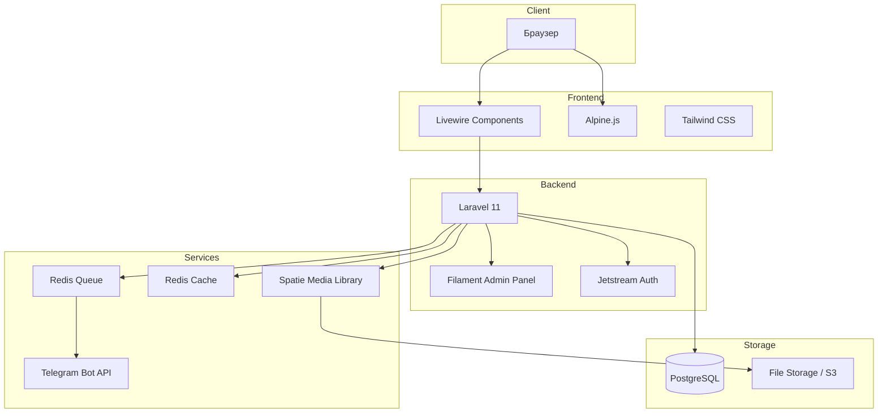
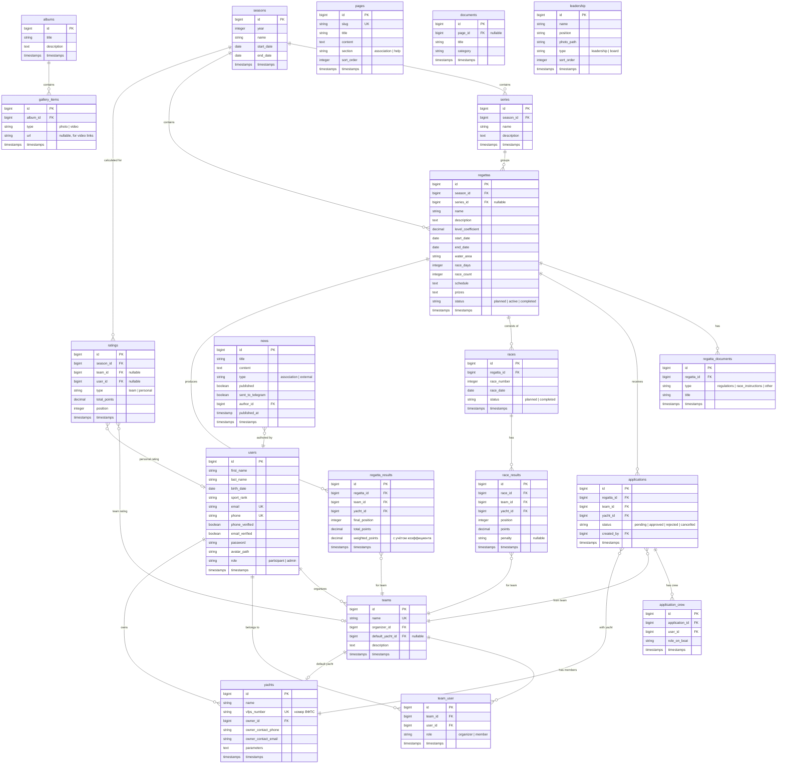
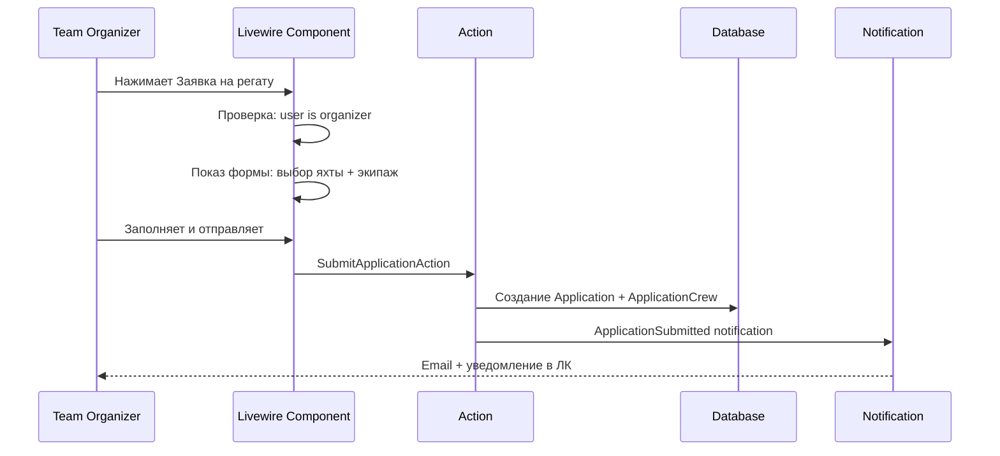
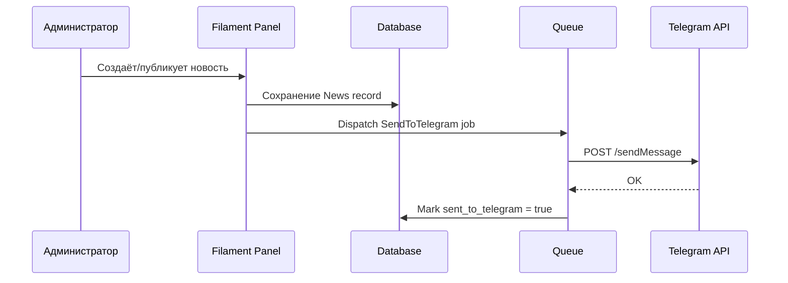
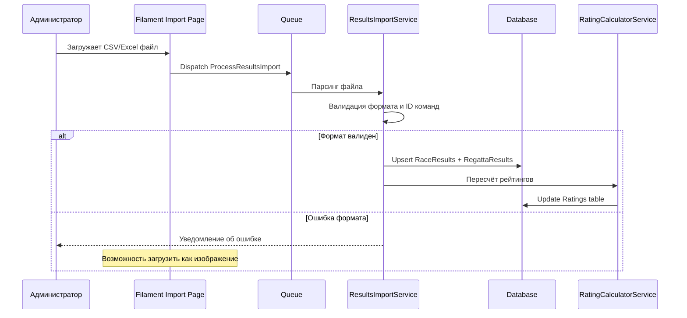

# DESIGN.md — Архитектура проекта «Yacht Association»

## 1. Обзор технологического стека (TALL)

| Компонент | Технология | Версия |
|-----------|-----------|--------|
| **T** — Стили | Tailwind CSS | 4.x |
| **A** — Интерактивность | Alpine.js | 3.x |
| **L** — Бэкенд | Laravel | 12.x |
| **L** — Динамические компоненты | Livewire | 3.x |
| Админ-панель | Filament PHP | 4.x |
| Аутентификация | Laravel Jetstream | 5.x (Livewire-стек) |
| Медиа-файлы | Spatie Media Library | 11.x |
| База данных | PostgreSQL | 16.x |
| Кэширование | Redis | 7.x |
| Очереди | Laravel Queue (Redis) | — |
| Поиск | Laravel Scout + Meilisearch | — |

---

## 2. Архитектура высокого уровня



---

## 3. Схема базы данных (ER-диаграмма)



---

## 4. Роли и права доступа

| Роль | Описание | Возможности |
|------|----------|-------------|
| `participant` | Зарегистрированный пользователь | Просмотр, регистрация яхты, создание/вступление в команду |
| `team_organizer` | Организатор команды (роль в `team_user`) | Подача заявок на регату, управление составом команды, привязка яхты |
| `admin` | Администратор сайта | Полный доступ к Filament-панели, управление всеми сущностями |

---

## 5. Структура директорий проекта

```
yacht/
├── app/
│   ├── Actions/                    # Бизнес-логика (Single Action Classes)
│   │   ├── Regatta/
│   │   │   ├── CreateRegattaAction.php
│   │   │   ├── ImportResultsAction.php
│   │   │   └── CalculateRatingsAction.php
│   │   ├── Team/
│   │   │   ├── CreateTeamAction.php
│   │   │   └── ManageTeamMembersAction.php
│   │   ├── Application/
│   │   │   ├── SubmitApplicationAction.php
│   │   │   └── CancelApplicationAction.php
│   │   └── News/
│   │       └── PublishNewsAction.php
│   │
│   ├── Filament/                   # Filament Admin Panel
│   │   ├── Resources/
│   │   │   ├── UserResource.php
│   │   │   ├── TeamResource.php
│   │   │   ├── YachtResource.php
│   │   │   ├── RegattaResource.php
│   │   │   ├── RaceResource.php
│   │   │   ├── ApplicationResource.php
│   │   │   ├── NewsResource.php
│   │   │   ├── AlbumResource.php
│   │   │   ├── SeasonResource.php
│   │   │   ├── SeriesResource.php
│   │   │   ├── PageResource.php
│   │   │   ├── LeadershipResource.php
│   │   │   └── DocumentResource.php
│   │   ├── Pages/
│   │   │   ├── Dashboard.php
│   │   │   └── ImportResults.php
│   │   └── Widgets/
│   │       ├── UpcomingRegattasWidget.php
│   │       ├── ApplicationsWidget.php
│   │       └── StatsOverviewWidget.php
│   │
│   ├── Http/
│   │   ├── Controllers/
│   │   │   ├── HomeController.php
│   │   │   ├── RegattaController.php
│   │   │   ├── TeamController.php
│   │   │   ├── YachtController.php
│   │   │   ├── NewsController.php
│   │   │   ├── GalleryController.php
│   │   │   ├── AssociationController.php
│   │   │   └── HelpController.php
│   │   └── Middleware/
│   │       └── EnsureTeamOrganizer.php
│   │
│   ├── Livewire/                   # Livewire Components
│   │   ├── Home/
│   │   │   ├── RegattaCalendar.php
│   │   │   ├── RegattaCountdown.php
│   │   │   └── NewsFeed.php
│   │   ├── Regatta/
│   │   │   ├── RegattaList.php
│   │   │   ├── RegattaCard.php
│   │   │   ├── ApplicationForm.php
│   │   │   └── ResultsTable.php
│   │   ├── Team/
│   │   │   ├── TeamList.php
│   │   │   ├── CreateTeam.php
│   │   │   └── ManageMembers.php
│   │   ├── Yacht/
│   │   │   ├── YachtList.php
│   │   │   ├── RegisterYacht.php
│   │   │   └── YachtCard.php
│   │   ├── Profile/
│   │   │   ├── Dashboard.php
│   │   │   ├── EditProfile.php
│   │   │   └── MyTeams.php
│   │   └── Gallery/
│   │       ├── AlbumList.php
│   │       └── AlbumView.php
│   │
│   ├── Models/
│   │   ├── User.php
│   │   ├── Team.php
│   │   ├── Yacht.php
│   │   ├── Season.php
│   │   ├── Series.php
│   │   ├── Regatta.php
│   │   ├── Race.php
│   │   ├── RaceResult.php
│   │   ├── RegattaResult.php
│   │   ├── Application.php
│   │   ├── ApplicationCrew.php
│   │   ├── News.php
│   │   ├── Album.php
│   │   ├── GalleryItem.php
│   │   ├── Page.php
│   │   ├── Document.php
│   │   ├── Leadership.php
│   │   └── Rating.php
│   │
│   ├── Notifications/
│   │   ├── ApplicationSubmitted.php
│   │   ├── ApplicationApproved.php
│   │   ├── ApplicationCancelled.php
│   │   └── RegattaReminder.php
│   │
│   ├── Services/
│   │   ├── TelegramService.php
│   │   ├── RatingCalculatorService.php
│   │   ├── ResultsImportService.php
│   │   └── VfpsLookupService.php
│   │
│   ├── Jobs/
│   │   ├── SendToTelegram.php
│   │   ├── ProcessResultsImport.php
│   │   └── RecalculateRatings.php
│   │
│   ├── Enums/
│   │   ├── UserRole.php
│   │   ├── TeamRole.php
│   │   ├── ApplicationStatus.php
│   │   ├── RegattaStatus.php
│   │   ├── NewsType.php
│   │   └── GalleryItemType.php
│   │
│   └── Policies/
│       ├── TeamPolicy.php
│       ├── YachtPolicy.php
│       ├── ApplicationPolicy.php
│       └── RegattaPolicy.php
│
├── database/
│   ├── migrations/
│   │   ├── 0001_create_users_table.php
│   │   ├── 0002_create_yachts_table.php
│   │   ├── 0003_create_teams_table.php
│   │   ├── 0004_create_team_user_table.php
│   │   ├── 0005_create_seasons_table.php
│   │   ├── 0006_create_series_table.php
│   │   ├── 0007_create_regattas_table.php
│   │   ├── 0008_create_regatta_documents_table.php
│   │   ├── 0009_create_applications_table.php
│   │   ├── 0010_create_application_crew_table.php
│   │   ├── 0011_create_races_table.php
│   │   ├── 0012_create_race_results_table.php
│   │   ├── 0013_create_regatta_results_table.php
│   │   ├── 0014_create_news_table.php
│   │   ├── 0015_create_albums_table.php
│   │   ├── 0016_create_gallery_items_table.php
│   │   ├── 0017_create_pages_table.php
│   │   ├── 0018_create_documents_table.php
│   │   ├── 0019_create_leadership_table.php
│   │   └── 0020_create_ratings_table.php
│   │
│   ├── seeders/
│   │   ├── DatabaseSeeder.php
│   │   ├── YachtSeeder.php          # Импорт существующего списка яхт
│   │   ├── PageSeeder.php           # Начальные страницы
│   │   └── AdminUserSeeder.php
│   │
│   └── factories/
│       ├── UserFactory.php
│       ├── TeamFactory.php
│       ├── YachtFactory.php
│       └── RegattaFactory.php
│
├── resources/
│   ├── views/
│   │   ├── layouts/
│   │   │   ├── app.blade.php         # Основной макет
│   │   │   └── guest.blade.php       # Макет для гостей
│   │   │
│   │   ├── pages/
│   │   │   ├── home.blade.php
│   │   │   ├── association/
│   │   │   │   ├── index.blade.php
│   │   │   │   ├── charter.blade.php
│   │   │   │   ├── leadership.blade.php
│   │   │   │   ├── board.blade.php
│   │   │   │   ├── policy.blade.php
│   │   │   │   ├── rules.blade.php
│   │   │   │   ├── regulations.blade.php
│   │   │   │   └── decisions.blade.php
│   │   │   ├── competitions/
│   │   │   │   ├── index.blade.php
│   │   │   │   └── show.blade.php
│   │   │   ├── teams/
│   │   │   │   ├── index.blade.php
│   │   │   │   └── show.blade.php
│   │   │   ├── yachts/
│   │   │   │   ├── index.blade.php
│   │   │   │   └── show.blade.php
│   │   │   ├── ratings/
│   │   │   │   └── index.blade.php
│   │   │   ├── help/
│   │   │   │   └── index.blade.php
│   │   │   ├── gallery/
│   │   │   │   ├── index.blade.php
│   │   │   │   └── album.blade.php
│   │   │   └── news/
│   │   │       ├── index.blade.php
│   │   │       └── show.blade.php
│   │   │
│   │   ├── profile/
│   │   │   ├── dashboard.blade.php
│   │   │   ├── edit.blade.php
│   │   │   ├── teams.blade.php
│   │   │   └── yachts.blade.php
│   │   │
│   │   ├── livewire/                  # Шаблоны Livewire-компонентов
│   │   │   ├── home/
│   │   │   ├── regatta/
│   │   │   ├── team/
│   │   │   ├── yacht/
│   │   │   ├── profile/
│   │   │   └── gallery/
│   │   │
│   │   └── components/                # Blade-компоненты
│   │       ├── countdown-timer.blade.php
│   │       ├── regatta-card.blade.php
│   │       ├── team-card.blade.php
│   │       ├── yacht-card.blade.php
│   │       ├── news-card.blade.php
│   │       ├── person-card.blade.php
│   │       └── navigation.blade.php
│   │
│   ├── css/
│   │   └── app.css
│   └── js/
│       └── app.js
│
├── routes/
│   ├── web.php                        # Публичные маршруты
│   ├── auth.php                       # Jetstream auth routes
│   └── api.php                        # API (webhook для TG и т.д.)
│
├── config/
│   ├── filament.php
│   ├── jetstream.php
│   ├── media-library.php
│   └── telegram.php                   # Настройки Telegram-бота
│
├── tests/
│   ├── Feature/
│   │   ├── Auth/
│   │   ├── Regatta/
│   │   ├── Team/
│   │   ├── Yacht/
│   │   └── Application/
│   └── Unit/
│       ├── RatingCalculatorTest.php
│       └── ResultsImportTest.php
│
├── doc.md                             # Техническое задание
├── DESIGN.md                          # Этот файл
├── composer.json
├── package.json
├── tailwind.config.js
├── vite.config.js
└── .env.example
```

---

## 6. Маршрутизация (Routes)

### Публичные маршруты

| Метод | URI | Контроллер / Компонент | Описание |
|-------|-----|----------------------|----------|
| GET | `/` | `HomeController@index` | Главная страница |
| GET | `/association` | `AssociationController@index` | Раздел Ассоциация |
| GET | `/association/{slug}` | `AssociationController@show` | Подстраница Ассоциации |
| GET | `/competitions` | `RegattaController@index` | Список регат |
| GET | `/competitions/{regatta}` | `RegattaController@show` | Карточка регаты |
| GET | `/teams` | `TeamController@index` | Список команд |
| GET | `/teams/{team}` | `TeamController@show` | Карточка команды |
| GET | `/yachts` | `YachtController@index` | Список яхт |
| GET | `/yachts/{yacht}` | `YachtController@show` | Карточка яхты |
| GET | `/ratings` | `RatingsController@index` | Рейтинги |
| GET | `/help` | `HelpController@index` | Раздел помощь |
| GET | `/news` | `NewsController@index` | Список новостей |
| GET | `/news/{news}` | `NewsController@show` | Новость |
| GET | `/gallery` | `GalleryController@index` | Галерея |
| GET | `/gallery/{album}` | `GalleryController@show` | Альбом |

### Защищённые маршруты (auth)

| Метод | URI | Компонент | Описание |
|-------|-----|-----------|----------|
| GET | `/profile` | `Livewire\Profile\Dashboard` | Личный кабинет |
| GET | `/profile/teams` | `Livewire\Profile\MyTeams` | Мои команды |
| GET | `/profile/teams/create` | `Livewire\Team\CreateTeam` | Создание команды |
| GET | `/profile/yachts/register` | `Livewire\Yacht\RegisterYacht` | Регистрация яхты |

### Админ-панель (Filament)

| URI | Описание |
|-----|----------|
| `/admin` | Dashboard Filament |
| `/admin/users` | Управление пользователями |
| `/admin/teams` | Управление командами |
| `/admin/yachts` | Управление яхтами |
| `/admin/regattas` | Управление регатами |
| `/admin/applications` | Управление заявками |
| `/admin/news` | Управление новостями |
| `/admin/gallery` | Управление галереей |
| `/admin/pages` | Управление страницами |
| `/admin/import-results` | Импорт результатов |

---

## 7. Livewire-компоненты (детализация)

### `Home\RegattaCalendar`
- Интерактивный календарь с отметками регат
- Клик по дате → переход к регате
- Данные: список регат текущего сезона

### `Home\RegattaCountdown`
- Таймер обратного отсчёта до ближайшей регаты
- Кнопка «Заявка на регату»
- Alpine.js для отображения таймера на клиенте

### `Home\NewsFeed`
- Пагинированный список новостей
- Фильтрация по типу (ассоциация / внешние)

### `Regatta\ApplicationForm`
- Форма подачи заявки на регату
- Выбор команды (где пользователь — организатор)
- Выбор яхты (привязанная или из списка)
- Формирование экипажа из участников команды

### `Regatta\ResultsTable`
- Таблица результатов регаты
- Отображение промежуточных и итоговых результатов
- Sorting, expandable rows для просмотра гонок

### `Team\CreateTeam`
- Форма создания команды
- Автоматическое назначение создателя организатором
- Привязка яхты по умолчанию

### `Yacht\RegisterYacht`
- Форма регистрации яхты
- Автопоиск по номеру ВФПС из существующего списка
- Валидация уникальности, уведомление о занятости

---

## 8. Модели и связи

### `User`
```php
// Relationships
hasMany: yachts (owned)
belongsToMany: teams (through team_user, with pivot role)
hasMany: applications (created)
hasMany: news (authored)
// Computed
isTeamOrganizer(Team $team): bool
isAdmin(): bool
```

### `Team`
```php
belongsTo: organizer (User)
belongsTo: defaultYacht (Yacht, nullable)
belongsToMany: members (User, through team_user, with pivot role)
hasMany: applications
hasMany: raceResults
hasMany: regattaResults
hasMany: ratings
```

### `Yacht`
```php
belongsTo: owner (User)
hasMany: applications
hasMany: raceResults
hasMany: regattaResults
// Spatie Media Library: photos
```

### `Regatta`
```php
belongsTo: season
belongsTo: series (nullable)
hasMany: races
hasMany: applications
hasMany: regattaResults
hasMany: documents (RegattaDocument)
// Spatie Media Library: documents, images
```

### `Application`
```php
belongsTo: regatta
belongsTo: team
belongsTo: yacht
belongsTo: createdBy (User)
hasMany: crew (ApplicationCrew)
// Scopes: pending(), approved()
```

### `Race`
```php
belongsTo: regatta
hasMany: results (RaceResult)
```

### `Rating`
```php
belongsTo: season
belongsTo: team (nullable)
belongsTo: user (nullable)
// Scopes: teamRatings(), personalRatings()
```

---

## 9. Ключевые бизнес-процессы

### 9.1. Подача заявки на регату



### 9.2. Публикация новости + Telegram



### 9.3. Импорт результатов соревнований



---

## 10. Filament Admin — ресурсы и кастомные страницы

### Ресурсы (CRUD)

| Resource | Особенности |
|----------|-------------|
| `UserResource` | Фильтры по ролям, управление командами пользователя |
| `TeamResource` | Inline-редактирование состава, привязка яхты |
| `YachtResource` | Поиск по ВФПС номеру, связь с владельцем |
| `RegattaResource` | Relation Manager для гонок и документов, статусы |
| `ApplicationResource` | Approve/Reject actions, просмотр экипажа |
| `NewsResource` | Rich-editor, toggle публикации, отправка в TG |
| `AlbumResource` | Bulk upload через Spatie ML, разделение фото/видео |
| `SeasonResource` | Связь с регатами и сериями |
| `PageResource` | Markdown/WYSIWYG editor для текстовых страниц |
| `LeadershipResource` | Сортировка drag-n-drop, фото |

### Кастомные страницы

| Страница | Функциональность |
|----------|-----------------|
| `ImportResults` | Upload CSV/Excel, preview, confirm import |
| `Dashboard` | Виджеты: ближайшие регаты, новые заявки, статистика |

---

## 11. Интеграции

### Telegram Bot API
- **Назначение**: Автоматическая публикация новостей в TG-канал
- **Реализация**: `TelegramService` использует HTTP-клиент Laravel
- **Триггер**: Event `NewsPublished` → Listener → Job `SendToTelegram`
- **Конфигурация**: `config/telegram.php` (bot token, channel ID)

### Импорт данных ВФПС
- **Назначение**: Автоподсказка при регистрации яхты
- **Реализация**: Seeder для начального импорта; `VfpsLookupService` для поиска
- **Источник**: CSV/Excel файл с реестром яхт ВФПС

---

## 12. Медиа-файлы (Spatie Media Library)

| Модель | Коллекции | Преобразования |
|--------|-----------|----------------|
| `User` | `avatar` | thumb (100x100), medium (300x300) |
| `Yacht` | `photos` | thumb, gallery (800x600) |
| `Regatta` | `documents`, `images` | — |
| `News` | `cover`, `attachments` | thumb, og-image (1200x630) |
| `GalleryItem` | `media` | thumb (200x200), large (1920x1080) |
| `Leadership` | `photo` | card (400x400) |
| `Document` | `file` | — |
| `RegattaDocument` | `file` | — |

---

## 13. Кэширование

| Ключ | TTL | Содержимое |
|------|-----|-----------|
| `home.upcoming_regatta` | 1 час | Ближайшая регата + countdown |
| `home.calendar.{season_id}` | 1 час | Данные календаря сезона |
| `ratings.team.{season_id}` | 6 часов | Командный рейтинг сезона |
| `ratings.personal.{season_id}` | 6 часов | Личный рейтинг сезона |
| `pages.{slug}` | 24 часа | Контент статических страниц |

Инвалидация: через Model Observers при обновлении связанных данных.

---

## 14. Очереди (Jobs)

| Job | Queue | Описание |
|-----|-------|----------|
| `SendToTelegram` | `notifications` | Отправка новости в TG-канал |
| `ProcessResultsImport` | `imports` | Обработка загруженного файла результатов |
| `RecalculateRatings` | `default` | Пересчёт рейтингов после импорта |
| `ProcessMediaConversions` | `media` | Обработка изображений (Spatie ML) |

---

## 15. Этапы реализации

### Этап 1 — Фундамент
- Инициализация Laravel 11 + Jetstream (Livewire)
- Установка и настройка Filament PHP
- Установка Tailwind CSS, Alpine.js, Spatie Media Library
- Миграции БД (все таблицы)
- Модели с отношениями
- Seeders (админ, тестовые данные, список яхт ВФПС)

### Этап 2 — Публичная часть
- Главная страница (календарь, countdown, новости)
- Раздел «Ассоциация» (статические страницы из БД)
- Раздел «Соревнования» (список + карточка регаты)
- Раздел «Команды» (список + карточка)
- Раздел «Яхты» (список + карточка)
- Раздел «Помощь»
- Раздел «Галерея»

### Этап 3 — Личный кабинет
- Регистрация и авторизация (Jetstream)
- Профиль пользователя
- Регистрация яхты (с автопоиском ВФПС)
- Создание и управление командой
- Подача заявок на регату

### Этап 4 — Админ-панель (Filament)
- Все CRUD-ресурсы
- Импорт результатов (CSV/Excel)
- Управление заявками
- Публикация новостей
- Управление галереей (bulk upload)
- Управление статическими страницами

### Этап 5 — Интеграции и рейтинги
- Telegram-интеграция (публикация новостей)
- Система расчёта рейтингов
- Результаты соревнований (таблицы)
- Уведомления (email + in-app)

### Этап 6 — Полировка
- SEO-оптимизация
- Адаптивная мобильная версия
- Performance (кэширование, оптимизация запросов)
- Тестирование (Feature + Unit)
- Деплой

---

## 16. Зависимости (composer.json)

```json
{
    "require": {
        "php": "^8.2",
        "laravel/framework": "^11.0",
        "laravel/jetstream": "^5.0",
        "livewire/livewire": "^3.0",
        "filament/filament": "^3.0",
        "spatie/laravel-medialibrary": "^11.0",
        "spatie/laravel-permission": "^6.0",
        "maatwebsite/excel": "^3.1",
        "nutgram/nutgram": "^4.0",
        "laravel/scout": "^10.0",
        "meilisearch/meilisearch-php": "^1.0"
    },
    "require-dev": {
        "pestphp/pest": "^2.0",
        "laravel/pint": "^1.0",
        "larastan/larastan": "^2.0"
    }
}
```

---

## 17. Переменные окружения (.env)

```env
# Database
DB_CONNECTION=pgsql
DB_HOST=127.0.0.1
DB_PORT=5432
DB_DATABASE=yacht
DB_USERNAME=yacht
DB_PASSWORD=secret

# Redis
REDIS_HOST=127.0.0.1
REDIS_PORT=6379

# Queue
QUEUE_CONNECTION=redis

# Telegram
TELEGRAM_BOT_TOKEN=
TELEGRAM_CHANNEL_ID=

# Media Storage
MEDIA_DISK=s3
AWS_ACCESS_KEY_ID=
AWS_SECRET_ACCESS_KEY=
AWS_DEFAULT_REGION=
AWS_BUCKET=

# Meilisearch
SCOUT_DRIVER=meilisearch
MEILISEARCH_HOST=http://127.0.0.1:7700
MEILISEARCH_KEY=
```
